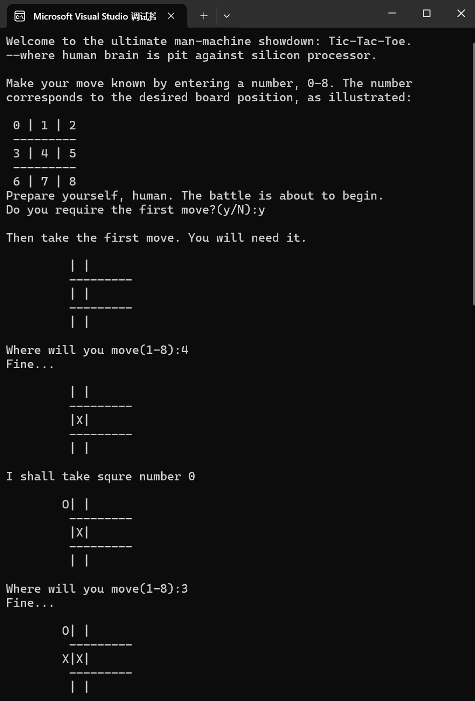
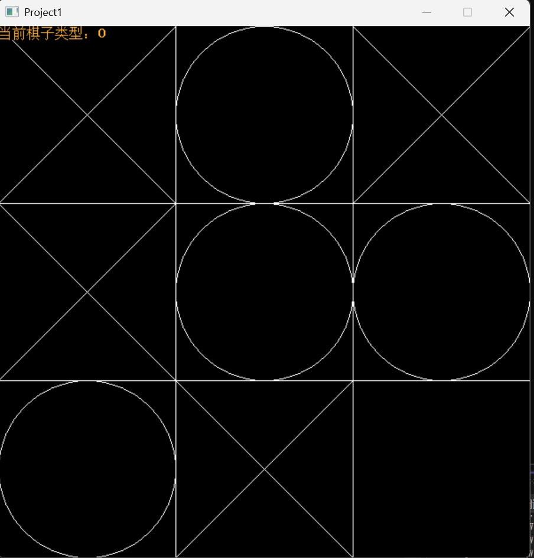

# C++游戏开发
## 基于directX的游戏开发
## Demo 1 学习界面弹窗
## Demo 2 利用windows.h在windows上编辑文字
## Demo 2-2 window上载入图片
## Demo 3 全屏蓝色警告（x
## Demo 4 用directX 展示图片
## Demo 5 **桶接子弹游戏(幼儿版)*
## Demo 6 烟花动画演示
## Demo 7 随机展示一幅图片中的部分，并缩放显示
## Demo 8 **火箭移动躲避陨石游戏*
    - 帧序列出现问题
## Demo 9 在windows上显示文字
## 之后的项目由于找不到Direct的相关头文件项目被迫中止（但是代码存在）

## Project 1
> from Beginning C++ Through Game programming 《C++游戏编程入门》
- 不同的*.cpp 代表不同的游戏。
- 从不同的项目中，对C++的继承、封装、多态、指针、引用有了更为深刻的理解。

## 关于两版Tic-Tac-Toe
第一版在/proj_One/Tic-Tac-Toe.cpp中
第二版在https://github.com/Solile/GameDemoEasyX/blob/project1/Tic-Tac_Toe.cpp中

第一版本是pve 玩家通过选择填入的空格，电脑AI自己根据取胜逻辑进行对抗。
第二版本是pvp 玩家分别执笔'O'和'X'，在图像中选择自己想要下的位置。

两个版本虽然采用不同的编写方式，并且用不同的方式进行实现。但是主要的运行逻辑是基本一致的。(毕竟对于游戏来所，玩家的获胜逻辑是相似的)
同一游戏的两种方式的阐释，对游戏开发的理解进一步加深。

> 第一版

> 第二版

